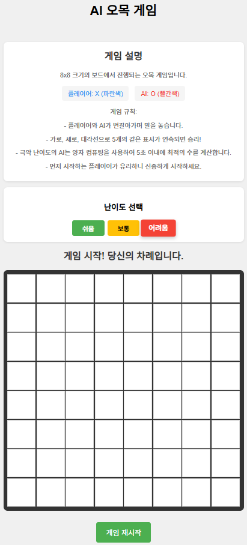
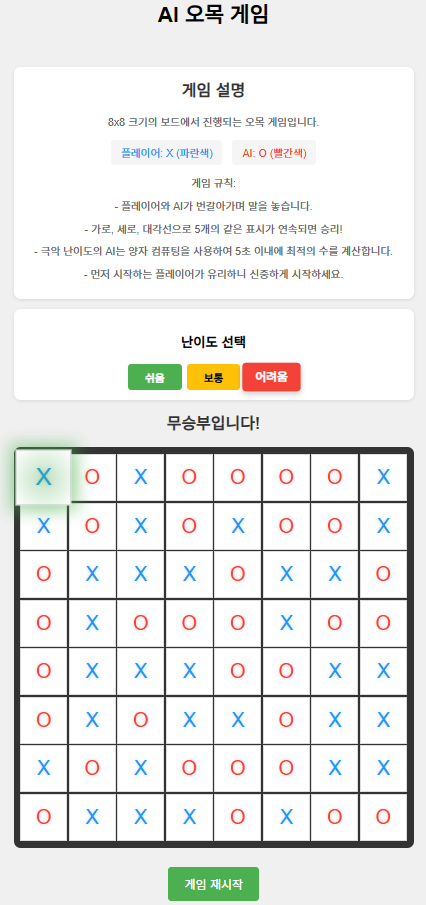
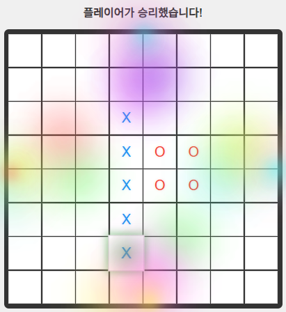

# 🎮 AI 오목 모바일 게임





## 🎯 게임 개요
HTML5와 JavaScript로 구현된 인공지능 오목 게임입니다. 플레이어는 AI와 대결하며, 다양한 난이도에서 도전할 수 있습니다.

## ✨ 주요 기능
- 🤖 3가지 난이도의 AI 대전
  - 쉬움: 기본적인 전략 사용
  - 보통: 중급 전략과 방어 능력
  - 어려움: 고급 전략과 공격적 플레이
- 🎨 현대적인 UI/UX
  - 반응형 디자인
  - 부드러운 애니메이션
  - 직관적인 인터페이스
- 🎵 몰입감 있는 효과
  - 돌 놓는 효과음
  - 승리/패배 효과음
  - 승리 시 폭죽 애니메이션
- 📱 모바일 최적화
  - 터치 스크린 지원
  - 모바일 기기에서도 부드러운 플레이

## 🎮 게임 규칙
- 8x8 크기의 보드에서 진행
- 플레이어(X)와 AI(O)가 번갈아가며 돌을 놓음
- 가로, 세로, 대각선으로 5개의 같은 표시가 연속되면 승리
- 모든 칸이 채워지면 무승부

## 🚀 시작하기
1. 저장소 클론
```bash
git clone [저장소 URL]
```

2. 게임 실행
- `index.html` 파일을 웹 브라우저에서 열기
- 또는 GitHub Pages(https://h2aler.github.io/HTML5_AI_GAME_ONE_MOBILE/)
- 를 통해 온라인으로 플레이
  

## 🛠 기술 스택
- HTML5
- CSS3
- JavaScript (ES6+)
- 반응형 웹 디자인

## 📱 호환성
- 데스크톱 브라우저 (Chrome, Firefox, Safari, Edge)
- 모바일 브라우저 (iOS, Android)
- 태블릿 기기

## 🎨 디자인 특징
- 모던한 UI/UX
- 부드러운 애니메이션
- 직관적인 컨트롤
- 반응형 레이아웃

## 🎵 사운드 효과
- 돌 놓는 효과음
- 승리/패배 효과음
- 모든 효과음은 무료 라이센스 사용

## 🤝 기여
버그 리포트나 기능 제안은 Issues 섹션을 통해 해주세요.

# 📢 중요한 공지
## 📄 라이센스

모든 자료의 저작권은 **[H2aler(김재현: KIM JAEHYUN)]**에게 있으며,  
허가 없이 **복제, 배포, 전송, 전시** 등의 행위를 **금지**합니다.

